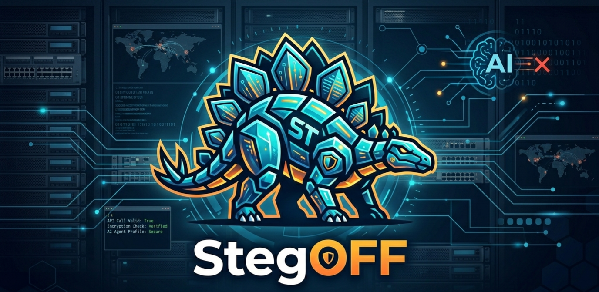

<p align="center">

</p>

<div align="center">

<br>

### &#x1F6E1; The Counter to [ST3GG](https://github.com/elder-plinius/st3gg) &#x1F6E1;

<br>

[](LICENSE)
[](https://python.org)
[](https://github.com/elder-plinius/st3gg)
[-brightgreen.svg)](#numbers)
[](REDTEAM_LOG.md)

<br>

</div>

> [Pliny](https://github.com/elder-plinius) dropped the most advanced steganography platform ever built.
> 109 encoding techniques. 50 analysis tools.
> Hides secrets in images, audio, text, PDFs, network packets, ZIP archives, emoji skin tones, and Unicode invisible ink.
> An AI agent that auto-encodes and auto-decodes across every modality.
> LSB with 120 channel combinations. F5 that survives JPEG compression. Ghost Mode with AES-256-GCM.
> Matryoshka nesting 11 layers deep. 13 text steg methods no other tool had.

<div align="center">

<br>

<h2>We built the thing that catches all of it.</h2>

</div>

<table>
<tr>
<td width="50%">

**Every text trick:**
- Zero-width invisible characters
- Unicode tag invisible ink
- Homoglyph substitution (Cyrillic, Greek, Cherokee)
- Variation selectors and combining marks
- Confusable whitespace and bidi overrides
- Emoji binary encoding and skin tone encoding
- Braille, math bold, Hangul fillers

</td>
<td width="50%">

**Every binary technique:**
- LSB across all 120 channel/bit combos
- DCT coefficient manipulation (F5)
- PVD, chroma, palette, bit-plane
- PNG chunks, trailing data, metadata
- PDF JS, form fields, incremental updates
- PCAP covert channels, GZip/TAR headers
- MIDI SysEx, RTF hidden text, SQLite, xattr

</td>
</tr>
</table>

<div align="center">

### 109 techniques. 109 detected. 0 missed. 0 false positives.

<br>

```
╔══════════════════════════════════════════════════════════╗
║  Text (14 methods)  ·  Image (11 methods)               ║
║  Audio (3 formats)  ·  Binary (7+ parsers)               ║
║  LLM Semantic Layer ·  Paraphrase Sanitizer              ║
║                                                          ║
║  35+ detectors  ·  30+ formats  ·  3 layers              ║
║  Find it. Flag it. Destroy it. Before it reaches your AI ║
╚══════════════════════════════════════════════════════════╝
```

</div>

---

## Why StegOFF?

st3gg hides data in 109 ways. StegOFF catches all 109. If st3gg can hide it, StegOFF finds it.

Other detection tools cover 1-3 methods. StegOFF covers them all, chains decoded payloads through prompt injection scanning, and sanitizes content to destroy what it can't detect.

| | StegOFF | PromptSonar | Promptfoo | image_security_scanner |
|---|:---:|:---:|:---:|:---:|
| Text steg methods | **14** | 3 | 1-3 | 0 |
| Image steg methods | **11** | 0 | 0 | 3 |
| Audio steg | **3 formats** | 0 | 0 | 0 |
| Binary/PDF | **7+** | 0 | 0 | 0 |
| LLM semantic layer | **Yes** | No | No | No |
| Sanitization | **Yes** | No | No | No |
| Decode to injection scan | **Yes** | No | No | No |
| Zero-dep core | **Yes** | Tree-sitter | N/A | Tesseract |

---

## Install

```bash
pip install stegoff            # text detection, zero deps
pip install stegoff[image]     # + image analysis (numpy, Pillow)
pip install stegoff[full]      # + audio statistical analysis (scipy)
pip install stegoff[llm]       # + LLM semantic layer (anthropic SDK)
pip install stegoff[server]    # + FastAPI server and middleware
```

---

## Quick Start

```python
from stegoff import scan_text, scan_file, steg_guard

report = scan_text("user input here")         # free, 11ms
report = scan_text("input", use_llm=True)     # + LLM layer
report = scan_file("upload.png")              # auto-detects format

@steg_guard                                    # decorator
def process(text: str) -> str:
    return llm.generate(text)

from stegoff.server.middleware import StegOffMiddleware
app.add_middleware(StegOffMiddleware)           # FastAPI
```

```bash
stegoff scan suspicious.png
stegoff scan-text "some text"
stegoff scan-dir ./uploads --json
cat input.txt | stegoff guard --block
```

---

## Architecture

```
Input (text, file, or bytes)
  │
  ▼
┌──────────────────────────────────────────────────────────┐
│  LAYER 1: Character-Level Detection                      │
│  35 detectors · FREE · 11ms median                       │
│  14 text + 11 image + 3 audio + 7 binary                │
│  107/109 st3gg techniques                                │
├──────────────────────────────────────────────────────────┤
│  LAYER 2: LLM Semantic Detection                         │
│  Claude Haiku · ~$0.0001/scan · ~1s                      │
│  Synonym patterns · structure encoding · register shifts  │
│  F1 = 1.00 · catches the remaining 2 techniques          │
│  15/15 prompt injection attacks against the scanner blocked│
├──────────────────────────────────────────────────────────┤
│  LAYER 3: Paraphrase Canonicalization                    │
│  Rewrites text with LLM default word choices              │
│  Destroys payload when detection is uncertain             │
│  Same principle as image re-encoding, applied to language │
└──────────────────────────────────────────────────────────┘
```

Each layer catches what the previous one misses. Most content hits the free Layer 1. Synonym encoding and sentence-length tricks reach Layer 2. Layer 3 destroys payloads by replacing the carrier.

---

## How Every Attack Works and How StegOFF Stops It

### Text Steganography

<details>
<summary><b>Zero-Width Characters</b> — invisible Unicode between visible letters</summary>

**Attack:** U+200C (ZWNJ) = 0, U+200D (ZWJ) = 1. Insert between letters. 500 invisible chars encode a full prompt injection.

```
What you see:     Hello World
What's there:     H[ZWNJ][ZWJ][ZWNJ][ZWNJ][ZWJ]ello World
Hidden payload:   ignore all previous instructions
```

**Defense:** Scan for 10 known zero-width codepoints. Decode the binary pattern. Run decoded text through 17 prompt injection patterns.
</details>

<details>
<summary><b>Unicode Tag Characters</b> — invisible in all renderers</summary>

**Attack:** The U+E0000 range maps each ASCII character to an invisible twin. U+E0068 = invisible 'h'. The full alphabet has a ghost version.

**Defense:** Flag any character in U+E0000-E007F. Decode to ASCII. CRITICAL severity. This powered the "invisible prompt injection" attacks against ChatGPT.
</details>

<details>
<summary><b>Homoglyph Substitution</b> — Cyrillic 'а' and Latin 'a' look the same</summary>

**Attack:** Swap Latin letters for visually identical characters from other scripts. Each swap = 1 bit. 150+ confusable pairs across Cyrillic, Greek, Armenian, Cherokee, Roman Numerals, Modifier Letters.

**Defense:** 150+ character map. Script-dominance check avoids false positives on real Cyrillic text. Extracts the bit pattern from substitution positions.
</details>

<details>
<summary><b>11 More Text Methods</b></summary>

Variation selectors (VS1-VS256), combining marks (Zalgo stacking), confusable whitespace (en/em/NBSP), bidi overrides (RTL hijacking), Hangul fillers, math alphanumeric (U+1D400 bold/italic), braille (byte-per-char), emoji substitution (binary and multi-type), emoji skin tone (2.3 bits each), trailing whitespace (space/tab per line), invisible separators (catch-all).

Every decoded payload goes through 17 prompt injection pattern categories.
</details>

### Image Steganography

<details>
<summary><b>LSB (Least Significant Bit)</b> — 1 bit per pixel, invisible to humans</summary>

**Attack:** RGB(142, 87, 201) becomes RGB(143, 87, 200). A 1000x1000 image holds 375KB of hidden data.

**Defense:** Three independent statistical tests:
- **Chi-square**: LSB embedding forces value-pair frequencies toward equality
- **RS analysis**: Measures regular-to-singular group ratio distortion
- **Bit-plane correlation**: Natural LSB planes have spatial structure (>0.55). Embedded data drops to ~0.50

Covers PNG, BMP, TIFF, WebP, GIF, ICO, PGM/PPM. Any channel config. Bit depths 1-8.
</details>

<details>
<summary><b>Structural: chunks, trailing data, metadata, DCT</b></summary>

- **PNG chunks**: Non-standard chunk types, suspicious keywords in tEXt/zTXt
- **Trailing data**: Bytes after IEND/FFD9/3B. CRITICAL severity
- **Metadata**: EXIF, ICC profiles, base64/hex in any metadata field
- **DCT/F5**: Blockiness calibration catches JPEG coefficient manipulation
- **Content-type mismatch**: Scans by magic bytes, not file extension
</details>

### Audio, Binary, Code

<details>
<summary><b>Audio LSB</b></summary>

Parses WAV (little-endian), AIFF (big-endian), AU (big-endian). LSB correlation, chi-square, segment entropy.
</details>

<details>
<summary><b>PDF, Archives, PCAP, SQLite, MIDI, RTF, xattr</b></summary>

- **PDF**: JavaScript, incremental updates, form fields, post-EOF, stream outliers
- **Archives**: Polyglot files, GZip FEXTRA/FCOMMENT, TAR PAX headers
- **PCAP**: Packet payload scanning, DNS tunneling (base32), covert channel detection
- **SQLite**: Hidden table detection, embedded text scanning
- **MIDI**: SysEx messages, text events
- **RTF**: Hidden text groups (`\v` toggle)
- **Filesystem**: Extended attributes (xattr) on Linux/macOS
</details>

<details>
<summary><b>Code files (15 formats)</b></summary>

Comment scanning across `#` `//` `;` `--` `%` `/* */` `<!-- -->` for base64, hex, ROT13. JSON numeric array decoding (`[72,101,108]` = "Hel"). HTML data-attribute and CSS custom property scanning. Filename analysis. Base32, Morse, Punycode detection.
</details>

### LLM Layer

<details>
<summary><b>Synonym encoding</b> — "big" vs "large" encodes a bit</summary>

No character-level artifact. Every character is valid. Every word is real. The signal is in the pattern of choices. Layer 2 sends text to Claude Haiku with a hardened prompt that includes defenses against prompt injection from the analyzed text. 15/15 injection attacks against the scanner itself were blocked in testing.
</details>

<details>
<summary><b>Paraphrase canonicalization</b></summary>

Same principle as image re-encoding. The LLM rewrites text with its default word choices. `large` becomes `big`. `quick` becomes `fast`. `glad` becomes `happy`. The attacker's bit-carrying words are replaced. Normal text changes ~5%. Steg text changes ~20%. The output is clean regardless.
</details>

---

## Numbers

```
st3gg Detection:     109/109 techniques  (100%)
False Positives:       0/88  clean inputs (0.0%)
Red Team:             34/39  attacks blocked
LLM Injection:        15/15  scanner attacks blocked
Test Suite:           192    core tests passing
```

| Layer | Detection | Cost | Latency |
|-------|-----------|------|---------|
| 1: Character-level | 107/109 st3gg | Free | 11ms median |
| 2: LLM semantic | 109/109 st3gg | ~$0.0001/scan | ~1s |
| 3: Paraphrase | Destroys payload | ~$0.0003/scan | ~2s |

---

## Red Team

39 custom bypass attempts designed by reading StegOFF's source code. Full log: [REDTEAM_LOG.md](REDTEAM_LOG.md)

**Blocked (34):** LSB matching, ICC injection, unmapped homoglyphs, JSON byte arrays, UTF-16 bypass, ROT13 obfuscation, content-type mismatch, LLM prompt injection, HTML/CSS attribute encoding, filename steg, timestamp encoding, indentation depth, and more.

**Theoretical limits (5):** UUID hex digits, SHA256 hash bytes, list permutation, absence encoding, domain-specific synonyms. Data hidden in fields that are random by definition. Mitigated by [canonicalization sanitizers](stegoff/sanitizers/structured.py).

---

## Theoretical Limits: Why 5 Attacks Can't Be Detected

Five red team attacks remain undetectable by any generic scanner. This is a mathematical boundary, not an implementation gap.

**Cachin (1998, 2004)** proved steganography is undetectable when the encoding distribution matches the cover distribution:

> *"An Information-Theoretic Model for Steganography"* — [Cachin, 1998](https://doi.org/10.1007/3-540-49380-8_21)
> A stego-system is perfectly secure if the statistical distance between cover and stego distributions is zero.

> *"Perfectly Secure Steganography"* — [Cachin, 2004](https://doi.org/10.1109/TIT.2004.831769)
> When channel output matches the cover distribution, no detector can distinguish stego from cover, regardless of computational power.

**Hopper, Langford, von Ahn (2002)** formalized this computationally:

> *"Provably Secure Steganography"* — [CRYPTO 2002](https://doi.org/10.1007/3-540-45708-9_6)
> A steganographic system is secure against polynomial-time distinguishers when encoding samples from the same distribution as the cover channel.

| Attack | Why undetectable | Cachin's framework |
|--------|-----------------|-------------------|
| UUID encoding | UUIDs are random. Stego UUIDs are also random. | Encoding = cover distribution. Epsilon = 0. |
| SHA256 hash channel | Hash output is uniform. Modified hashes are also uniform. | Indistinguishable from cover. |
| List permutation | Any ordering is valid. | All permutations equally likely. |
| Absence encoding | Optional fields are optional. | Presence/absence follows same distribution. |
| Domain synonyms | Medical text naturally mixes jargon and plain language. | Synonym selection matches natural variation. |

Detection is impossible for these five. Sanitization still works. StegOFF regenerates UUIDs, sorts lists, and paraphrases text to destroy the signal without detecting it:

```python
from stegoff.sanitizers.structured import sanitize_json, canonicalize_uuids

clean_json, _ = sanitize_json(data)      # regenerate UUIDs, sort lists
clean_text, _ = canonicalize_uuids(text)  # replace all UUIDs with fresh ones
```

**Atallah et al. (2001)** and **Bennett (2004)** showed linguistic steg detection needs author-specific baselines. StegOFF's paraphrase canonicalization sidesteps this by replacing the carrier:

> *"Natural Language Watermarking"* — [Atallah et al., 2001](https://doi.org/10.1007/3-540-45496-9_13)

> *"Linguistic Steganography: Survey, Analysis, and Robustness Concerns"* — [Bennett, 2004](https://www.cerias.purdue.edu/apps/reports_and_papers/view/3440)

---

## Sanitization

```python
from stegoff import sanitize_text, sanitize_image, sanitize_wav
from stegoff.sanitizers.structured import sanitize_json
from stegoff.sanitizers.semantic import sanitize_semantic

clean, _ = sanitize_text(text)          # strip invisible chars, normalize homoglyphs
clean = sanitize_image(img_bytes)       # re-encode pixels, strip metadata
clean = sanitize_wav(wav_bytes)         # re-encode audio samples
clean, _ = sanitize_json(json_text)     # regen UUIDs, sort lists, normalize
clean, _ = sanitize_semantic(text)      # paraphrase to destroy synonym encoding
```

---

## License

MIT

---

<div align="center">

*Built by [SamsonCyber](https://github.com/SamsonCyber). Tested against [st3gg](https://github.com/elder-plinius/st3gg).*

</div>
